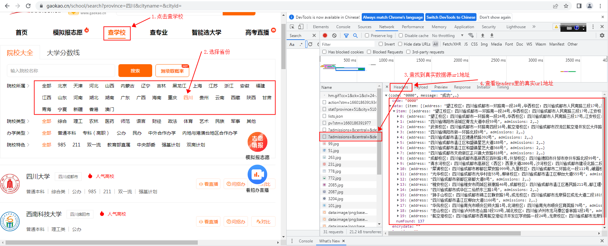
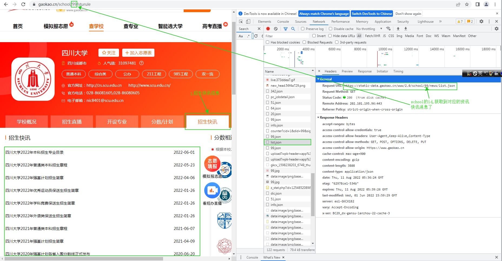
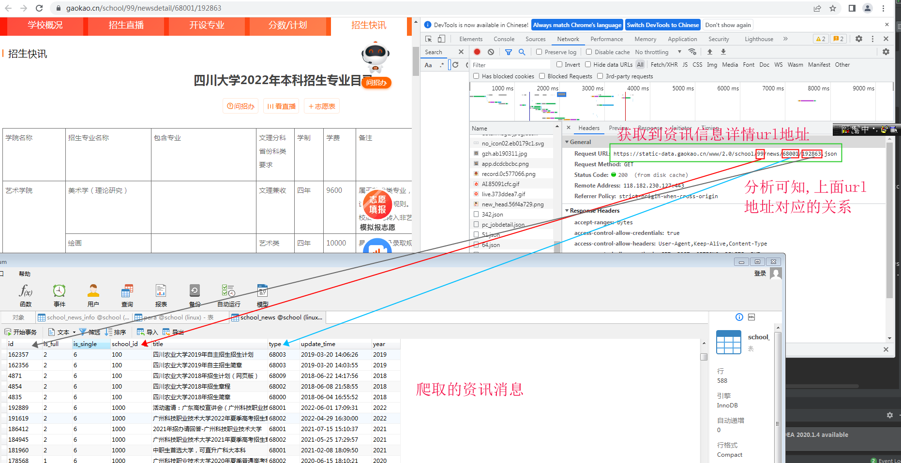
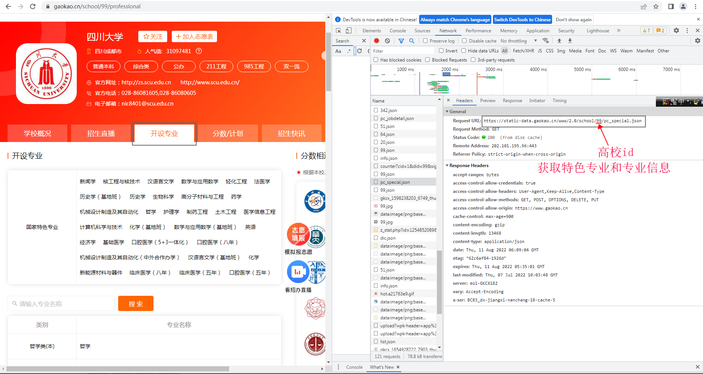
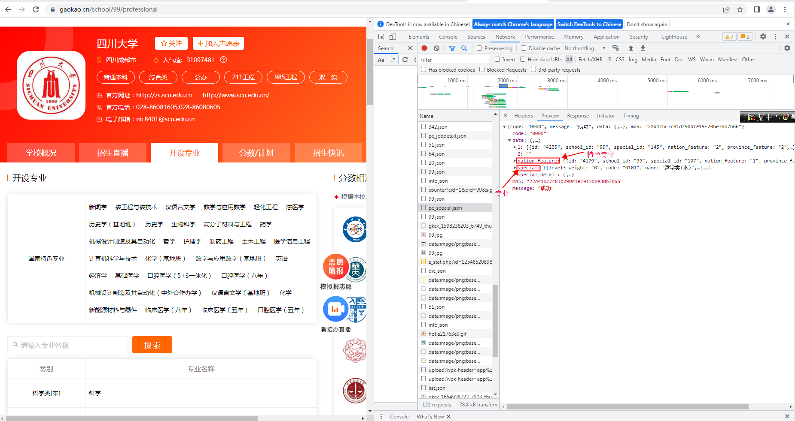

# 爬取掌上高考 地址:https://www.gaokao.cn/

## 前期准备
1.添加爬取和处理数据的依赖
```
        <dependency>
            <groupId>com.squareup.okhttp3</groupId>
            <artifactId>okhttp</artifactId>
            <version>4.9.0</version>
        </dependency>
        <dependency>
            <groupId>org.jsoup</groupId>
            <artifactId>jsoup</artifactId>
            <version>1.11.3</version>
        </dependency>
        <dependency>
            <groupId>com.alibaba</groupId>
            <artifactId>fastjson</artifactId>
            <version>1.2.73</version>
        </dependency>
```
2.编写爬取数据的工具类MyHttpClient类
```
package zjw.utils;

import okhttp3.ConnectionPool;
import okhttp3.OkHttpClient;
import okhttp3.Request;

import java.io.IOException;
import java.util.concurrent.TimeUnit;

/**
 * http客户端工具
 */
public class MyHttpClient {

    /**
     * okhttp客户端
     */
    private static final OkHttpClient OK_HTTP_CLIENT = new OkHttpClient
            .Builder()
            //设置连接超时时间为30秒
            .connectTimeout(30, TimeUnit.SECONDS)
            //自定义线程池任务调度策略
            //.dispatcher(new Dispatcher(new ThreadPoolExecutor(1, 1, 2, TimeUnit.MINUTES, new LinkedBlockingQueue<>(6000), r -> new Thread("spider task"))))
            //设置代理，所以在代码中没有使用代理ip进行抓取，而正常实践工作中抓取数据一般都会使用代理ip，大家可以自己加入代理ip进行爬取
            //.proxy();
            .connectionPool(new ConnectionPool(2, 1, TimeUnit.MINUTES))
            .build();

    /**
     * 同步获取网页数据
     *
     * @param url 网站地址
     * @return 网页内容
     * @throws IOException
     */
    public static String fetchHtmlSync(String url) throws IOException {
        try {
            Thread.sleep(20);
        } catch (InterruptedException e) {
            e.printStackTrace();
        }
        Request request = new Request.Builder().url(url)
                .addHeader("User-Agent", "Mozilla/5.0 (Windows NT 10.0; Win64; x64) AppleWebKit/537.36 (KHTML, like Gecko) Chrome/99.0.4844.51 Safari/537.36")
                .addHeader("Referer", "http://www.weather.com.cn/")
                .addHeader("Cookie", "f_city=%E9%95%BF%E6%B2%99%7C101250101%7C; Hm_lvt_080dabacb001ad3dc8b9b9049b36d43b=1646805682,1647329569,1647396910; Hm_lpvt_080dabacb001ad3dc8b9b9049b36d43b=1647410932")
                .build();
        return OK_HTTP_CLIENT.newCall(request).execute().body().string();
    }

}
```

**我们只需要调用MyHttpClient类中的fetchHtmlSync()方法,传入url地址即可爬取到数据**

## 爬取所有省份高校
### 1.分析获取到真实url地址

```
获取学校url,所有省份。返回的数据为json

北京
https://api.eol.cn/web/api/?admissions=&central=&department=&dual_class=&f211=&f985=&is_doublehigh=&is_dual_class=&keyword=&nature=&page=1&province_id=11&ranktype=&request_type=1&school_type=&size=20&type=&uri=apidata/api/gk/school/lists&signsafe=f6c4ff371f38b63d186699e3704a1ccc

天津
https://api.eol.cn/web/api/?admissions=&central=&department=&dual_class=&f211=&f985=&is_doublehigh=&is_dual_class=&keyword=&nature=&page=1&province_id=12&ranktype=&request_type=1&school_type=&size=20&type=&uri=apidata/api/gk/school/lists&signsafe=7f1f320fc146d50473a50f725a20caee

河北
https://api.eol.cn/web/api/?admissions=&central=&department=&dual_class=&f211=&f985=&is_doublehigh=&is_dual_class=&keyword=&nature=&page=1&province_id=13&ranktype=&request_type=1&school_type=&size=20&type=&uri=apidata/api/gk/school/lists&signsafe=b625b3fd0d2ed9ee1a3b7f07707fe177

山西
https://api.eol.cn/web/api/?admissions=&central=&department=&dual_class=&f211=&f985=&is_doublehigh=&is_dual_class=&keyword=&nature=&page=1&province_id=14&ranktype=&request_type=1&school_type=&size=20&top_school_id=[262,2332,1669]&type=&uri=apidata/api/gk/school/lists&signsafe=0811715105d3d873f9e9b29c879b3407

内蒙古
https://api.eol.cn/web/api/?admissions=&central=&department=&dual_class=&f211=&f985=&is_doublehigh=&is_dual_class=&keyword=&nature=&page=1&province_id=15&ranktype=&request_type=1&school_type=&size=20&type=&uri=apidata/api/gk/school/lists&signsafe=f783d8f479c3ff8a4422efcb6500660f

辽宁
https://api.eol.cn/web/api/?admissions=&central=&department=&dual_class=&f211=&f985=&is_doublehigh=&is_dual_class=&keyword=&nature=&page=1&province_id=21&ranktype=&request_type=1&school_type=&size=20&top_school_id=[204,2350]&type=&uri=apidata/api/gk/school/lists&signsafe=81f703f1056a499fa35629351317c027

吉林
https://api.eol.cn/web/api/?admissions=&central=&department=&dual_class=&f211=&f985=&is_doublehigh=&is_dual_class=&keyword=&nature=&page=1&province_id=22&ranktype=&request_type=1&school_type=&size=20&type=&uri=apidata/api/gk/school/lists&signsafe=2e1a584b65f29d05234f755e25af5155

黑龙江
https://api.eol.cn/web/api/?admissions=&central=&department=&dual_class=&f211=&f985=&is_doublehigh=&is_dual_class=&keyword=&nature=&page=1&province_id=23&ranktype=&request_type=1&school_type=&size=20&type=&uri=apidata/api/gk/school/lists&signsafe=af01169435ae39b92b5c2cea48051a74

上海
https://api.eol.cn/web/api/?admissions=&central=&department=&dual_class=&f211=&f985=&is_doublehigh=&is_dual_class=&keyword=&nature=&page=1&province_id=31&ranktype=&request_type=1&school_type=&size=20&top_school_id=[318,309,135,323,310,1010,1011,308,1092,676,706,329]&type=&uri=apidata/api/gk/school/lists&signsafe=741907eeb7c546a316bbf25102be1684

江苏
https://api.eol.cn/web/api/?admissions=&central=&department=&dual_class=&f211=&f985=&is_doublehigh=&is_dual_class=&keyword=&nature=&page=1&province_id=32&ranktype=&request_type=1&school_type=&size=20&top_school_id=[77,173,164]&type=&uri=apidata/api/gk/school/lists&signsafe=99cc3a645b6bad5e0040094a375cf7e8

浙江
https://api.eol.cn/web/api/?admissions=&central=&department=&dual_class=&f211=&f985=&is_doublehigh=&is_dual_class=&keyword=&nature=&page=1&province_id=33&ranktype=&request_type=1&school_type=&size=20&type=&uri=apidata/api/gk/school/lists&signsafe=2deca69d4f4c9d4052090b4816a84e49

安徽
https://api.eol.cn/web/api/?admissions=&central=&department=&dual_class=&f211=&f985=&is_doublehigh=&is_dual_class=&keyword=&nature=&page=1&province_id=34&ranktype=&request_type=1&school_type=&size=20&top_school_id=[1831]&type=&uri=apidata/api/gk/school/lists&signsafe=612c320e6e537a827db135c3f8599b4d

福建
https://api.eol.cn/web/api/?admissions=&central=&department=&dual_class=&f211=&f985=&is_doublehigh=&is_dual_class=&keyword=&nature=&page=1&province_id=35&ranktype=&request_type=1&school_type=&size=20&top_school_id=[2421,474,1891,1888,1893,1897,1889,476,1878,1899,1905,1902]&type=&uri=apidata/api/gk/school/lists&signsafe=a3615ebf38a8f7e3d4d49807fd52def3

江西
https://api.eol.cn/web/api/?admissions=&central=&department=&dual_class=&f211=&f985=&is_doublehigh=&is_dual_class=&keyword=&nature=&page=1&province_id=36&ranktype=&request_type=1&school_type=&size=20&top_school_id=[900]&type=&uri=apidata/api/gk/school/lists&signsafe=c3ff5ed3f85d093b81fd69422f49354c

山东
https://api.eol.cn/web/api/?admissions=&central=&department=&dual_class=&f211=&f985=&is_doublehigh=&is_dual_class=&keyword=&nature=&page=1&province_id=37&ranktype=&request_type=1&school_type=&size=20&top_school_id=[499,1400,64,554,2146,2123,2508]&type=&uri=apidata/api/gk/school/lists&signsafe=ddf9773908e1059b0e8d9b0d00bd0b13

河南
https://api.eol.cn/web/api/?admissions=&central=&department=&dual_class=&f211=&f985=&is_doublehigh=&is_dual_class=&keyword=&nature=&page=1&province_id=41&ranktype=&request_type=1&school_type=&size=20&top_school_id=[876,853,1324,1114,1125,1334]&type=&uri=apidata/api/gk/school/lists&signsafe=9bec3e1fd816ac3d39fb610a1742bad2

湖北
https://api.eol.cn/web/api/?admissions=&central=&department=&dual_class=&f211=&f985=&is_doublehigh=&is_dual_class=&keyword=&nature=&page=1&province_id=42&ranktype=&request_type=1&school_type=&size=20&top_school_id=[1105,3378,1551,817]&type=&uri=apidata/api/gk/school/lists&signsafe=87a2205a84ff672d5d74546b9aad419e

湖南
https://api.eol.cn/web/api/?admissions=&central=&department=&dual_class=&f211=&f985=&is_doublehigh=&is_dual_class=&keyword=&nature=&page=1&province_id=43&ranktype=&request_type=1&school_type=&size=20&type=&uri=apidata/api/gk/school/lists&signsafe=5453eed3863a18a28af2b26b508ea6c9

广东
https://api.eol.cn/web/api/?admissions=&central=&department=&dual_class=&f211=&f985=&is_doublehigh=&is_dual_class=&keyword=&nature=&page=1&province_id=44&ranktype=&request_type=1&school_type=&size=20&top_school_id=[3251,960,289,294,1096,643,977]&type=&uri=apidata/api/gk/school/lists&signsafe=67df9ac98adbfe5606d662bc0da67563

广西
https://api.eol.cn/web/api/?admissions=&central=&department=&dual_class=&f211=&f985=&is_doublehigh=&is_dual_class=&keyword=&nature=&page=1&province_id=45&ranktype=&request_type=1&school_type=&size=20&type=&uri=apidata/api/gk/school/lists&signsafe=595964a35128f5d20fd8bf561db926d0

海南
https://api.eol.cn/web/api/?admissions=&central=&department=&dual_class=&f211=&f985=&is_doublehigh=&is_dual_class=&keyword=&nature=&page=1&province_id=46&ranktype=&request_type=1&school_type=&size=20&type=&uri=apidata/api/gk/school/lists&signsafe=7c49bd656d264b0e8cfcda33f25a777e

重庆
https://api.eol.cn/web/api/?admissions=&central=&department=&dual_class=&f211=&f985=&is_doublehigh=&is_dual_class=&keyword=&nature=&page=1&province_id=50&ranktype=&request_type=1&school_type=&size=20&top_school_id=[119,179,1474,1009,1475,1476,2691,1496,1595,1483,2915]&type=&uri=apidata/api/gk/school/lists&signsafe=391f00e860c81556ba3e244506de2322

四川
https://api.eol.cn/web/api/?admissions=&central=&department=&dual_class=&f211=&f985=&is_doublehigh=&is_dual_class=&keyword=&nature=&page=1&province_id=51&ranktype=&request_type=1&school_type=&size=20&top_school_id=[99,263,231,778,772,2085,2087,3204,1131]&type=&uri=apidata/api/gk/school/lists&signsafe=14d14c9aa35fed6ae68b4eb20f978ec0

贵州
https://api.eol.cn/web/api/?admissions=&central=&department=&dual_class=&f211=&f985=&is_doublehigh=&is_dual_class=&keyword=&nature=&page=1&province_id=52&ranktype=&request_type=1&school_type=&size=20&top_school_id=[3299,2270,1562,3290]&type=&uri=apidata/api/gk/school/lists&signsafe=2b83129f001a9656de2388efc5e4cca5

云南
https://api.eol.cn/web/api/?admissions=&central=&department=&dual_class=&f211=&f985=&is_doublehigh=&is_dual_class=&keyword=&nature=&page=1&province_id=53&ranktype=&request_type=1&school_type=&size=20&type=&uri=apidata/api/gk/school/lists&signsafe=6375c5ecb9daef7a3896f0fa9a331f17

西藏
https://api.eol.cn/web/api/?admissions=&central=&department=&dual_class=&f211=&f985=&is_doublehigh=&is_dual_class=&keyword=&nature=&page=1&province_id=54&ranktype=&request_type=1&school_type=&size=20&type=&uri=apidata/api/gk/school/lists&signsafe=273928644ff78ef4fe75e2043ec7091b

陕西
https://api.eol.cn/web/api/?admissions=&central=&department=&dual_class=&f211=&f985=&is_doublehigh=&is_dual_class=&keyword=&nature=&page=1&province_id=61&ranktype=&request_type=1&school_type=&size=20&type=&uri=apidata/api/gk/school/lists&signsafe=b0eaaefe0f47d4e0c7af89fe255256d0

甘肃
https://api.eol.cn/web/api/?admissions=&central=&department=&dual_class=&f211=&f985=&is_doublehigh=&is_dual_class=&keyword=&nature=&page=1&province_id=62&ranktype=&request_type=1&school_type=&size=20&type=&uri=apidata/api/gk/school/lists&signsafe=0921dedc893b6d2828c9478026578c30

青海
https://api.eol.cn/web/api/?admissions=&central=&department=&dual_class=&f211=&f985=&is_doublehigh=&is_dual_class=&keyword=&nature=&page=1&province_id=63&ranktype=&request_type=1&school_type=&size=20&type=&uri=apidata/api/gk/school/lists&signsafe=3d5d5f97f242d37ed44a195428a4eb60

宁夏
https://api.eol.cn/web/api/?admissions=&central=&department=&dual_class=&f211=&f985=&is_doublehigh=&is_dual_class=&keyword=&nature=&page=1&province_id=64&ranktype=&request_type=1&school_type=&size=20&type=&uri=apidata/api/gk/school/lists&signsafe=f5113e6ded33b43a6256b25f0a7d1226

新疆
https://api.eol.cn/web/api/?admissions=&central=&department=&dual_class=&f211=&f985=&is_doublehigh=&is_dual_class=&keyword=&nature=&page=1&province_id=65&ranktype=&request_type=1&school_type=&size=20&type=&uri=apidata/api/gk/school/lists&signsafe=0960d0238ad15697d1e1f95f6a3cea86

香港
https://api.eol.cn/web/api/?admissions=&central=&department=&dual_class=&f211=&f985=&is_doublehigh=&is_dual_class=&keyword=&nature=&page=1&province_id=81&ranktype=&request_type=1&school_type=&size=20&type=&uri=apidata/api/gk/school/lists&signsafe=4fe4e95bf34a0f230030eb86e670854e

澳门
https://api.eol.cn/web/api/?admissions=&central=&department=&dual_class=&f211=&f985=&is_doublehigh=&is_dual_class=&keyword=&nature=&page=1&province_id=82&ranktype=&request_type=1&school_type=&size=20&type=&uri=apidata/api/gk/school/lists&signsafe=25a139be6ce99dfd2b474b86118b65bf
```
__注意:在url地址中page代表当前页,size代表当前页的数据个数。省份高校的总数可以从返回的数据numFound得知,故而可以可以有多少页。__

### 2.爬取高校数据
通过获取到的地址进行爬取,核心代码
```
                String url="";
                String jsonString = null;
                jsonString = MyHttpClient.fetchHtmlSync(url);
                JSONObject resout = JSONObject.parseObject(jsonString);
                if("0000".equals(resout.get("code").toString())){
                    JSONObject data = JSONObject.parseObject(resout.get("data").toString());
                    int numFound = Integer.parseInt(data.get("numFound").toString());
                    countPage = numFound%20==0?numFound/20:numFound/20+1;
                    Object item = data.get("item");
                    List<School> schools = JSONObject.parseArray(item.toString(), School.class);
                    for(School school:schools){
                        schoolService.deleteSchool(school);
                        schoolService.addSchool(school);
                        updateSchoolNews(school.getSchool_id());
                    }
                }else{
                    //访问频繁,暂停5分钟
                    Thread.sleep(1000*60*5);
                    i--;
                }

```
**爬取到数据,我们保存到了数据库里.**

## 爬取所有省份高校的资讯消息
### 1.分析获取到真实url地址


```
获取到资讯消息url地址,99为高校的id.
https://static-data.gaokao.cn/www/2.0/school/99/news/list.json
```
### 2.爬取高校资讯消息数据
核心代码如下
```
    /**
     * @Title updateSchool
     * @description 更新高校资讯信息
     * @author 郑洁文
     * @date 2022年8月8日 下午15:32
     * @param school_id
     */
    public static void updateSchoolNews(String school_id) throws IOException,VisitException {
        Map<String, String> mapUrl = analysisSchoolNewsUrl();
        String url = mapUrl.get("urlStart")+school_id+mapUrl.get("urlEnd");
        String s = MyHttpClient.fetchHtmlSync(url);
        JSONObject jsonObject = JSONObject.parseObject(s);
        //成功获取
        if("0000".equals(jsonObject.get("code").toString())){
            Object data = jsonObject.get("data");
            List<SchoolNews> schoolNews = JSON.parseArray(data.toString(), SchoolNews.class);
            List<SchoolNews> news = schoolNews.stream().limit(10).collect(Collectors.toList());
            //schoolNewsService.addSchoolNews(news);
            for(SchoolNews item:news){
                schoolNewsService.deleteSchoolNews(item);
                schoolNewsService.addSchoolNews(item);
                updateSchoolNewsInfo(item);
            }
        }else{
            throw new VisitException("访问频繁,没有获取到数据");
        }
    }
```

## 爬取所有省份高校的资讯消息详情
### 1.分析获取到真实url地址

```
获取到资讯消息详情url地址,99为高校的id.68001为type,192863为id.与资讯消息数据对应。
https://static-data.gaokao.cn/www/2.0/school/99/news/68001/192863.json

```
### 2.爬取高校资讯消息数据
核心代码如下
```
    /**
     * @Title updateSchoolNewsInfo
     * @description 更新高校资讯信息详情
     * @author 郑洁文
     * @date 2022年8月8日 下午16:40
     * @param schoolNews
     */
    public static void updateSchoolNewsInfo(SchoolNews schoolNews) throws IOException,VisitException {
        Map<String, String> mapUrl = analysisSchoolNewsInfoUrl();
        String url = mapUrl.get("urlStart")+schoolNews.getSchoolId()+mapUrl.get("urlEnd")+schoolNews.getType()+"/"+schoolNews.getId()+".json";
        String s = MyHttpClient.fetchHtmlSync(url);
        JSONObject jsonObject = JSONObject.parseObject(s);
        //成功获取
        if("0000".equals(jsonObject.get("code").toString())){
            Object data = jsonObject.get("data");
            SchoolNewsInfo schoolNewsInfo = JSON.parseObject(data.toString(), SchoolNewsInfo.class);
            schoolNewsInfoService.deleteSchoolNewsInfo(schoolNews);
            schoolNewsInfoService.addSchoolNewsInfo(schoolNewsInfo);
        }else{
            throw new VisitException("访问频繁,没有获取到数据");
        }
    }
```

## 爬取所有省份高校的开设专业
### 1.分析获取到真实url地址



```
获取到开设专业url地址,99为高校的id
https://static-data.gaokao.cn/www/2.0/school/99/pc_special.json
```


